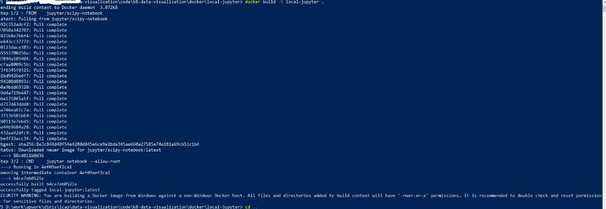
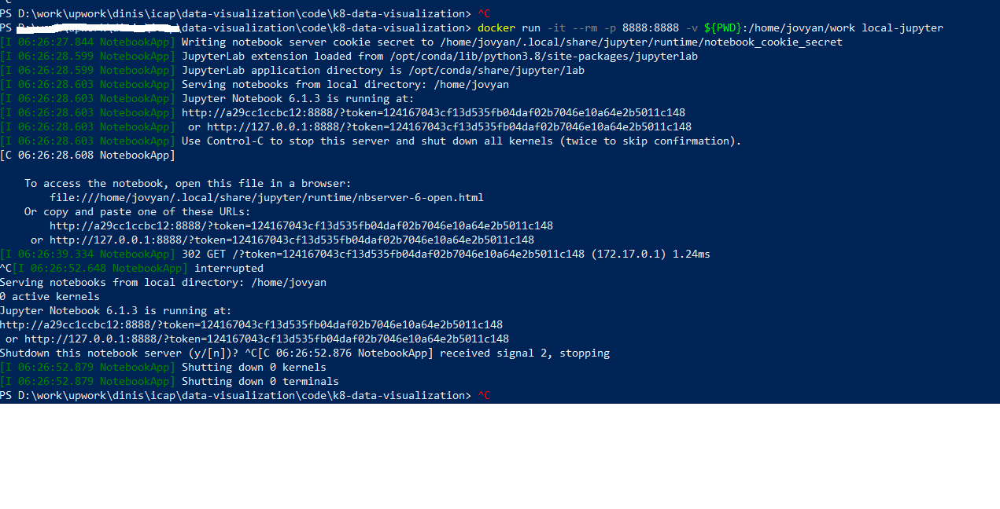
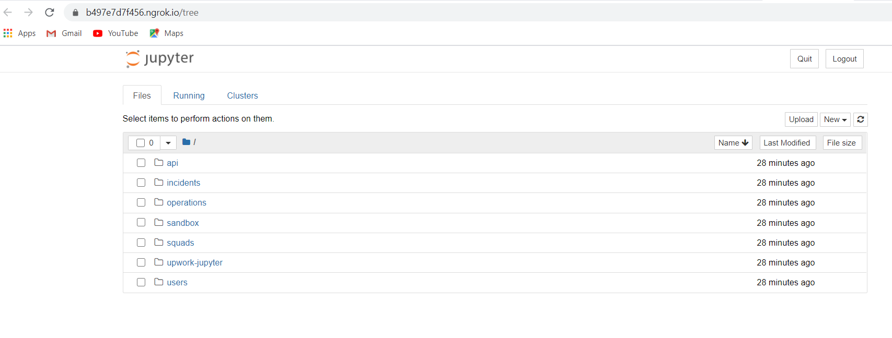
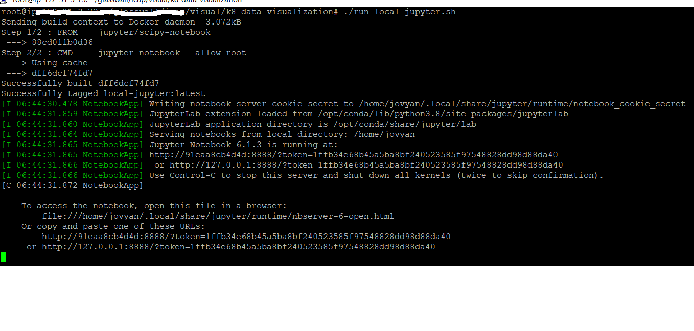

# k8-data-visualization

If you are working on this project via Upwork, see also our [Upwork Rules of Engagement](https://github.com/filetrust/Open-Source/blob/master/upwork/rules-of-engagement.md)

If you are newcomer, then please check [Glasswall newcomers checklist ](https://github.com/filetrust/Open-Source )

## Project Brief
Objective: Consume, process, normalize and visualize GitHub Issues data

* Glasswall ICAP project (see https://github.com/filetrust/program-icap) is currently under active development and there is a need to understand the exact issue status of all sub-projects

* There are a number of sub-projects (each with it's own set of issues)

  * https://github.com/filetrust/mvp-icap-service
  * https://github.com/filetrust/mvp-icap-cloud
  * https://github.com/filetrust/mvp-icap-squid-cache-proxy
  * https://github.com/filetrust/rebuild-k8s-filetypedetection
  * https://github.com/filetrust/icap-performance-tests
  * https://github.com/filetrust/rebuild-k8s
  * https://github.com/filetrust/k8-reverse-proxy

* At the moment we are using https://www.zenhub.com/extension to consolidate and understand the data, but there are a number of workflows that require the creation of data-connectors and custom visualizations

* Here is the recommended workflow for this project:
  * Create API (Python or Node) to consume data from GitHub (all repos are public, so there is no dependency on Glasswall to provide access)
  * Write Tests for all APIs created
  * Create CI Pipeline
  * Use Jupyter notebook to present data
  * Graph Nodes  : GitHub issues, GH repos, Authors and Projects.  And Edges : the relationships between them.
  * Create visualizations using native Jupyter APIs or other Javascript visualization APIs (like https://visjs.org/, https://plantuml.com/ , https://gojs.net/ , https://mermaid-js.github.io/)
  * Transform data into graph-based objects and visualize them
  * Create as much detailed technical documentation as possible (namely architecture and data-flow diagrams)

* Key points   
 * Setup a serverless workflow which gets triggered with GitHub issues events (We should evaluate if we can use github actions or else go with AWS)
 * The event data in JSON format (committed to a GitHub repo) to be injected to the elastic server(e..g what log_to_elk does for JIRA).
 * Leverage osbot_aws api from public APIS https://github.com/owasp-sbot/ managed by GW. The bot API will fetch data from the elastic server.
 * The raw issue data, to be consumed by the Jupyter Notebooks notebook.
 * The data stored on a separate repo will allow the Developers working on the visualization to not have to deal with the data collection.
 * For visualisation, use notebooks since they are good for prototyping, but we will need a Web Based UI to access the data.
 * All code should follow Coding guideline, formatted in IDE and static analysis need to be done.


## Running Jupyter Notebooks

Add support for running Jupyter Notebooks docker image locally (mounting the current source code as the root of the notebooks folder)

### Windows Environments

* Navigate to "k8-data-visualization\docker\local-jupyter" directory.
Fire the following command

```
docker build -t local-jupyter .
```
Local docker image will be built

<br><br>

* Navigate back to "k8-data-visualization\" directory.
Fire the following command

```
docker run -it --rm -p 8888:8888 -v ${PWD}:/home/jovyan/work local-jupyter
```
Local docker image will be started

<br><br>


* Access notebooks with the URL printed in the started logs.

<br><br>


### Unix and MAC Environments

* Fire the following command
```
sh run-local-jupyter.sh
```
Local docker image will be built and started

<br><br>

* Access notebooks with the URL printed in the started logs.

<br><br>


## Pull Request Guideline
* List the steps on how to execute the work you have done in the README.md(inside your folder)
* Create a screenshot of the output(if available) and have it posted in the issue comments
* Create a demo video to show the work you have done. Post the link of the video in the raw-videos and p-data-visulisation channel.
* Create a pull request
* Set the issue "pipeline" to "peer review"
* Set the issue "label" to "ready-for-review"
* Set the issue "reviews" to "dinis-cruz-gw" or "DinisCruz"
* In our slack channel inform Dinis and me with the Pull Request link

## Coding Guideline

These are the coding guidelines we tend to follow for Python projects at Glasswall

- [Code Formatting](#code-format)
- [Naming Conventions](#naming-conventions)
- [General](#general)

<a id="code-format"></a>
## Code Formatting

* Align formatting of code using common sense

* Parameter formatting (Readable and easy to find issues if any)

<br><br>

* Code lengths should be based on code readability (for example in the case below)

```
	CONST PARTNERED = 'We have partenered with multiple clients to look out '\

                       'for opportunities to get more clientelle'
```

 It is better to put all of that in one line

```
	CONST PARTNERED = 'We have partenered with multiple clients to look out for opportunities to get more clientelle'
```


<a id="naming-conventions"></a>
## Naming Conventions

* Keep separate classes in separate files

* Class names to follow upper camel case (class names should have underscores between words)
e.g
```
	class Http_Api_Issues:
```

* File names should match the class name. E.g. Above file to be saved as “Http_Api_Issues.py”

* Function names to follow lower camel case e.g

e.g.
```
def get_all_issues():
```

* We don’t follow any standards e.g. PEP. Code readability and easy to understand and debug are must.

E.g. Compare a more readable code

```
CONST_STACKOVERFLOW            = 'stackoverflow'
CONST_GLASSWALL                = 'glasswall'
CONST_GW_PROXY                 = 'gw-proxy'
```

With a lesser readable one

```
CONST_STACKOVERFLOW='stackoverflow'
CONST_GLASSWALL='glasswall'
CONST_GW_PROXY='gw-proxy'
```

* Put CONST (when used) on separate python, json or yaml files


<a id="general"></a>
## General

* Commit often and with clear commit messages

* You can use whatever font size or face you want, as long as that setting is not pushed to the main repo

* Align formatting of code using common sense
